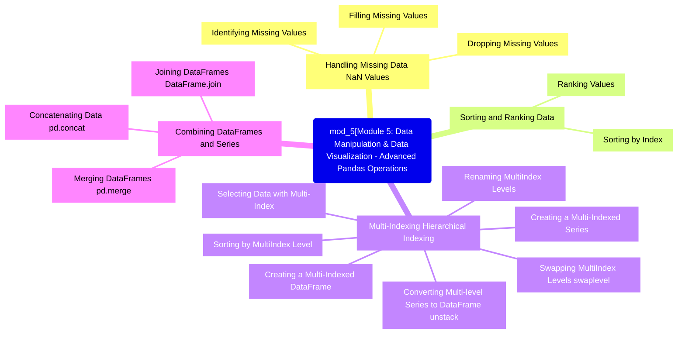

```mermaid
mindmap
root(mod_5[Module 5: Data Manipulation & Data Visualization - Advanced Pandas Operations)
    handling_missing_data[Handling Missing Data NaN Values]
        identifying_missing_values[Identifying Missing Values]
        dropping_missing_values[Dropping Missing Values]
        filling_missing_values[Filling Missing Values]
    sort_ranking_data[Sorting and Ranking Data]
        sorting_by_index[Sorting by Index]
        ranking_values[Ranking Values]
    multi_indexing[Multi-Indexing Hierarchical Indexing]
        creating_multiindexed_series[Creating a Multi-Indexed Series]
        selecting_multiindex[Selecting Data with Multi-Index]
        converting_unstack_df[Converting Multi-level Series to DataFrame unstack]
        creating_multidf[Creating a Multi-Indexed DataFrame]
        renaming_levels[Renaming MultiIndex Levels]
        swapping_levels[Swapping MultiIndex Levels swaplevel]
        sorting_multilevel[Sorting by MultiIndex Level]
    combining_dataframes_series[Combining DataFrames and Series]
        merging_dfs[Merging DataFrames pd.merge]
        joining_df[Joining DataFrames DataFrame.join]
        concatenating_data[Concatenating Data pd.concat]
```