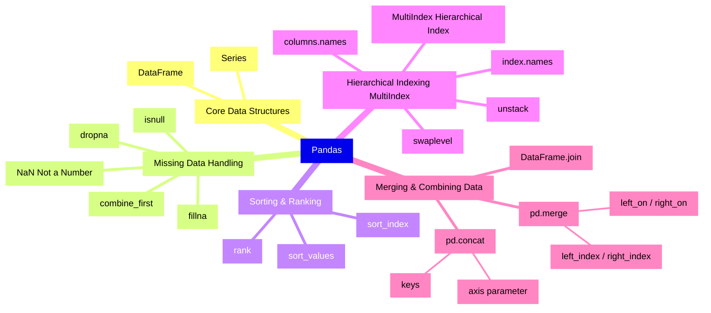

```mermaid
mindmap
  pandas_root[Pandas]
    mod_data_structures[Core Data Structures]
      concept_series[Series]
      concept_dataframe[DataFrame]
    mod_missing_data[Missing Data Handling]
      concept_nan[NaN Not a Number]
      func_isnull[isnull]
      func_dropna[dropna]
      func_fillna[fillna]
      func_combine_first[combine_first]
    mod_sorting_ranking[Sorting & Ranking]
      func_sort_index[sort_index]
      func_sort_values[sort_values]
      func_rank[rank]
    mod_hierarchical_indexing[Hierarchical Indexing MultiIndex]
      concept_multiindex[MultiIndex Hierarchical Index]
      func_unstack[unstack]
      attr_index_names[index.names]
      attr_columns_names[columns.names]
      func_swaplevel[swaplevel]
    mod_merging_combining[Merging & Combining Data]
      func_merge[pd.merge]
        param_left_on_right_on[left_on / right_on]
        param_left_index_right_index[left_index / right_index]
      func_join[DataFrame.join]
      func_concat[pd.concat]
        param_axis[axis parameter]
        param_keys[keys]
```