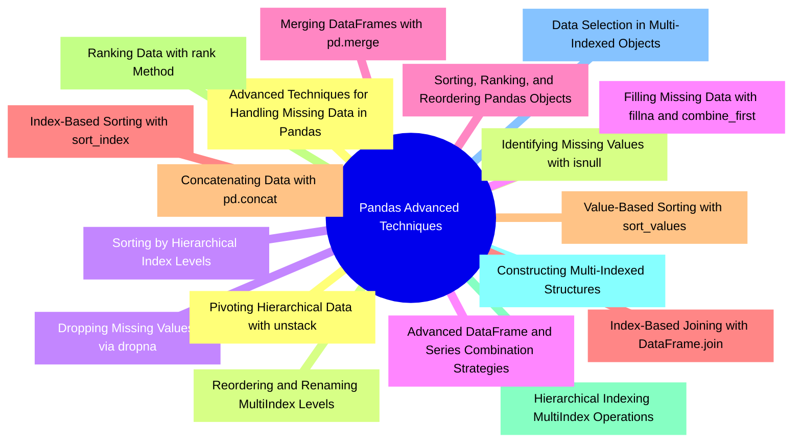

```mermaid
mindmap
root((Pandas Advanced Techniques))
    topic_missing_data[Advanced Techniques for Handling Missing Data in Pandas]
    sub_missing_isnull[Identifying Missing Values with isnull]
    sub_missing_dropna[Dropping Missing Values via dropna]
    sub_missing_fillna[Filling Missing Data with fillna and combine_first]
    topic_sorting_ranking[Sorting, Ranking, and Reordering Pandas Objects]
    sub_sorting_index[Index-Based Sorting with sort_index]
    sub_sorting_values[Value-Based Sorting with sort_values]
    sub_ranking_methods[Ranking Data with rank Method]
    topic_hierarchical_indexing[Hierarchical Indexing MultiIndex Operations]
    sub_hierarchical_construct[Constructing Multi-Indexed Structures]
    sub_hierarchical_select[Data Selection in Multi-Indexed Objects]
    sub_hierarchical_unstack[Pivoting Hierarchical Data with unstack]
    sub_hierarchical_rename[Reordering and Renaming MultiIndex Levels]
    sub_hierarchical_sort[Sorting by Hierarchical Index Levels]
    topic_combining_dataframes[Advanced DataFrame and Series Combination Strategies]
    sub_combining_merge[Merging DataFrames with pd.merge]
    sub_combining_join[Index-Based Joining with DataFrame.join]
    sub_combining_concat[Concatenating Data with pd.concat]
```