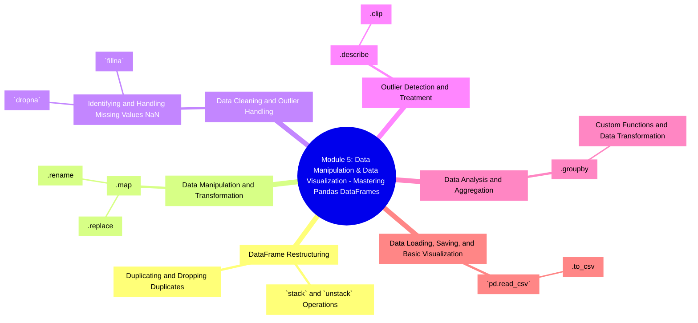

```mermaid
mindmap
root((Module 5: Data Manipulation & Data Visualization - Mastering Pandas DataFrames))
  sec_data_restructuring[DataFrame Restructuring]
    conc_stack_unstack[`stack` and `unstack` Operations]
    conc_dup_dropping[Duplicating and Dropping Duplicates]
  sec_data_manip_trans[Data Manipulation and Transformation]
    func_map[.map]
      conc_replace[.replace]
      conc_rename[.rename]
  sec_data_cleaning[Data Cleaning and Outlier Handling]
    func_missing_vals[Identifying and Handling Missing Values NaN]
      conc_fillna[`fillna`]
      conc_dropna[`dropna`]
  sec_outlier_treatment[Outlier Detection and Treatment]
    func_describe[.describe]
      conc_clip[.clip]
  sec_data_analysis_agg[Data Analysis and Aggregation]
    func_groupby[.groupby]
      conc_custom_funcs[Custom Functions and Data Transformation]
  sec_loading_vis[Data Loading, Saving, and Basic Visualization]
    func_read_csv[`pd.read_csv`]
      conc_to_csv[.to_csv]
```