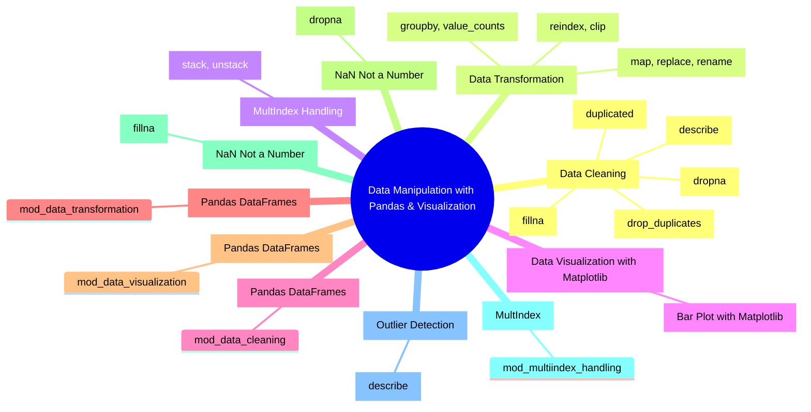

```mermaid
mindmap
root((Data Manipulation with Pandas & Visualization))
    mod_data_cleaning[Data Cleaning]
        subtopic_duplicated[duplicated]
        subtopic_drop_duplicates[drop_duplicates]
        subtopic_fillna[fillna]
        subtopic_dropna[dropna]
        subtopic_describe[describe]
    mod_data_transformation[Data Transformation]
        subtopic_map_replace_rename[map, replace, rename]
        subtopic_reindex_clip[reindex, clip]
        subtopic_groupby_value_counts[groupby, value_counts]
    mod_multiindex_handling[MultIndex Handling]
        subtopic_stack_unstack[stack, unstack]
    mod_data_visualization[Data Visualization with Matplotlib]
        subtopic_bar_plot_matplotlib[Bar Plot with Matplotlib]
    concept_pandas_df[Pandas DataFrames]  
        mod_data_cleaning
    concept_pandas_df[Pandas DataFrames]  
        mod_data_transformation
    concept_pandas_df[Pandas DataFrames]  
        mod_data_visualization
    concept_nan[NaN Not a Number]  
        subtopic_dropna[dropna]
    concept_nan[NaN Not a Number]  
        subtopic_fillna[fillna]
    concept_multiindex[MultIndex]  
        mod_multiindex_handling
    concept_outlier_detection[Outlier Detection]  
        subtopic_describe[describe]
```