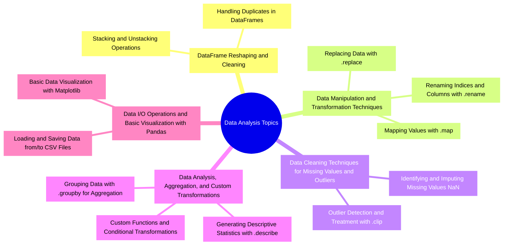

```mermaid
mindmap
  root((Data Analysis Topics))
    topic_reshaping_cleaning[DataFrame Reshaping and Cleaning]
      sub_stacking_unstacking[Stacking and Unstacking Operations]
      sub_handling_duplicates[Handling Duplicates in DataFrames]
    topic_manipulation_transformation[Data Manipulation and Transformation Techniques]
      sub_mapping_values[Mapping Values with .map]
      sub_replacing_data[Replacing Data with .replace]
      sub_renaming_indices[Renaming Indices and Columns with .rename]
    topic_missing_outliers_cleaning[Data Cleaning Techniques for Missing Values and Outliers]
      sub_identifying_missing[Identifying and Imputing Missing Values NaN]
      sub_outlier_detection[Outlier Detection and Treatment with .clip]
    topic_analysis_aggregation[Data Analysis, Aggregation, and Custom Transformations]
      sub_descriptive_stats[Generating Descriptive Statistics with .describe]
      sub_grouping_data[Grouping Data with .groupby for Aggregation]
      sub_custom_functions[Custom Functions and Conditional Transformations]
    topic_io_visualization[Data I/O Operations and Basic Visualization with Pandas]
      sub_loading_saving_csv[Loading and Saving Data from/to CSV Files]
      sub_matplotlib_plots[Basic Data Visualization with Matplotlib]
```