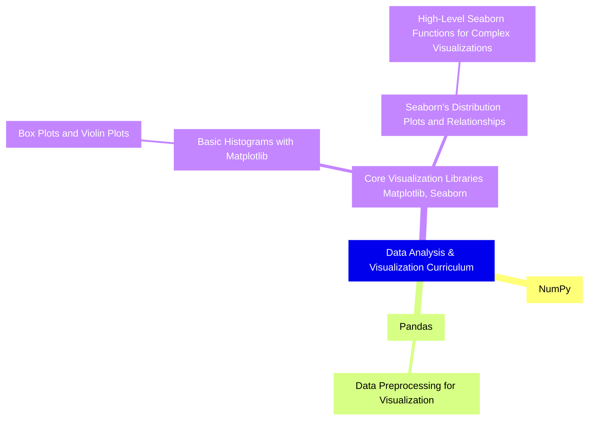

```mermaid
mindmap
  course_root[Data Analysis & Visualization Curriculum]
    prereq_numpy[NumPy]
    prereq_pandas[Pandas]
      concept_preprocessing[Data Preprocessing for Visualization]
    prereq_vislibs[Core Visualization Libraries Matplotlib, Seaborn]
      seq_matplotlib_histograms[Basic Histograms with Matplotlib]
        seq_boxplots[Box Plots and Violin Plots]
      adv_seaborn_distplots["Seaborn's Distribution Plots and Relationships"]
        adv_seaborn_complex[High-Level Seaborn Functions for Complex Visualizations]
```