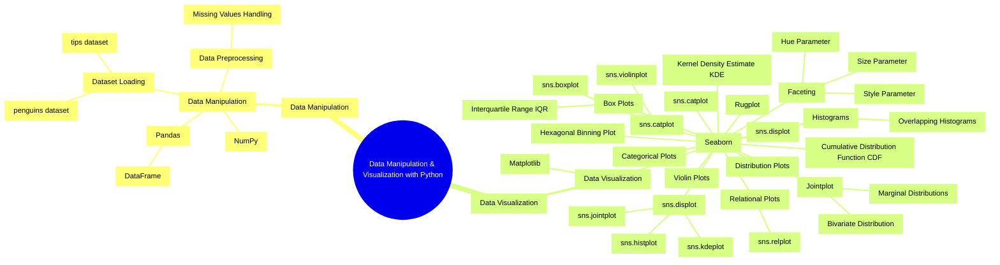

```mermaid
mindmap
root((Data Manipulation & Visualization with Python))
  course_root[Data Manipulation]
    mod_data_manipulation[Data Manipulation]
      tool_numpy[NumPy]
      tool_pandas[Pandas]
        concept_dataframe[DataFrame]
      task_dataset_loading[Dataset Loading]
        dataset_tips[tips dataset]
        dataset_penguins[penguins dataset]
      task_preprocessing[Data Preprocessing]
        task_missing_values[Missing Values Handling]
  course_root[Data Visualization]
    mod_data_visualization[Data Visualization]
      tool_matplotlib[Matplotlib]
      tool_seaborn[Seaborn]
        plot_histograms[Histograms]
          plot_overlapping_histograms[Overlapping Histograms]
        plot_jointplot[Jointplot]
          plot_bivariate_distribution[Bivariate Distribution]
          plot_marginal_distributions[Marginal Distributions]
        plot_hexagonal_binning[Hexagonal Binning Plot]
        plot_kde[Kernel Density Estimate KDE]
        plot_rugplot[Rugplot]
        plot_boxplots[Box Plots]
          concept_iqr[Interquartile Range IQR]
        plot_violinplots[Violin Plots]
        plot_relational[Relational Plots]
          func_relplot[sns.relplot]
        plot_distribution[Distribution Plots]
        plot_categorical[Categorical Plots]
        technique_faceting[Faceting]
          param_hue[Hue Parameter]
          param_style[Style Parameter]
          param_size[Size Parameter]
        plot_cdf[Cumulative Distribution Function CDF]
        func_displot[sns.displot]
          func_jointplot[sns.jointplot]
          func_histplot[sns.histplot]
          func_kdeplot[sns.kdeplot]
        func_catplot[sns.catplot]
          func_boxplot[sns.boxplot]
          func_violinplot[sns.violinplot]
        func_displot_2[sns.displot]
        func_catplot_2[sns.catplot]
```