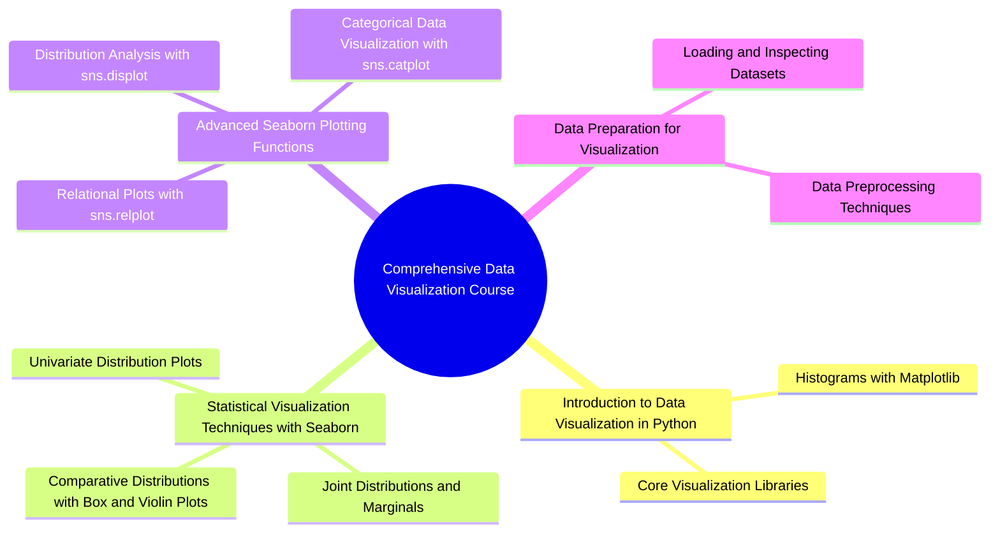

```mermaid
mindmap
root((Comprehensive Data Visualization Course))
  Introduction to Data Visualization in Python
    Core Visualization Libraries
    Histograms with Matplotlib
  Statistical Visualization Techniques with Seaborn
    Joint Distributions and Marginals
    Univariate Distribution Plots
    Comparative Distributions with Box and Violin Plots
  Advanced Seaborn Plotting Functions
    Relational Plots with sns.relplot
    Distribution Analysis with sns.displot
    Categorical Data Visualization with sns.catplot
  Data Preparation for Visualization
    Loading and Inspecting Datasets
    Data Preprocessing Techniques
```