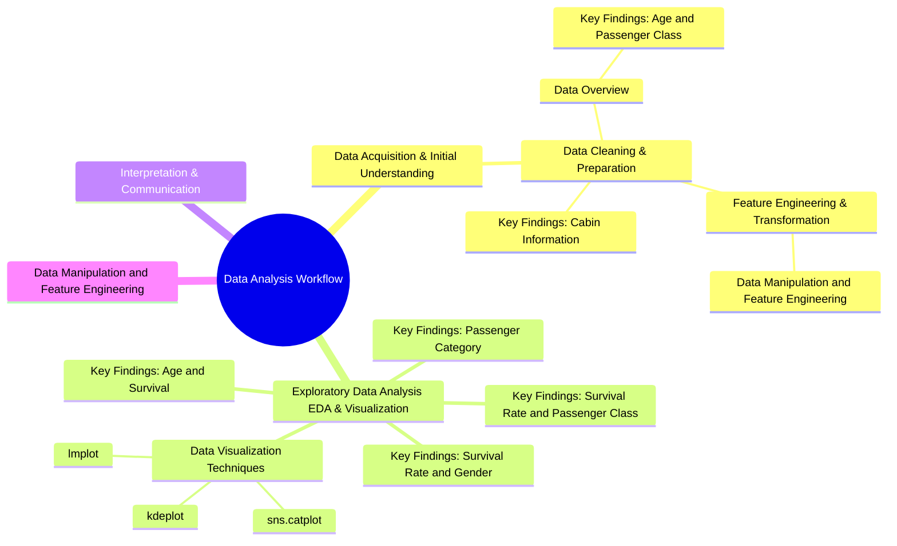

```mermaid
mindmap
  root((Data Analysis Workflow))
    Data Acquisition & Initial Understanding
      Data Cleaning & Preparation
        Feature Engineering & Transformation
          Data Manipulation and Feature Engineering
        Data Overview
          Key Findings: Age and Passenger Class
        Key Findings: Cabin Information
    Exploratory Data Analysis EDA & Visualization
      Key Findings: Survival Rate and Gender
      Key Findings: Passenger Category
      Key Findings: Survival Rate and Passenger Class
      Key Findings: Age and Survival
      Data Visualization Techniques 
        sns.catplot
        kdeplot
        lmplot      
    Interpretation & Communication
    Data Manipulation and Feature Engineering
```