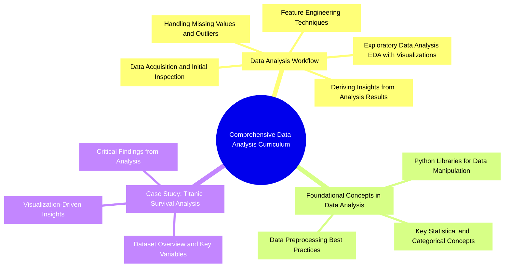

```mermaid
mindmap
  root((Comprehensive Data Analysis Curriculum))
    topic_data_analysis_workflow[Data Analysis Workflow]
      subtopic_data_acquisition[Data Acquisition and Initial Inspection]
      subtopic_missing_values[Handling Missing Values and Outliers]
      subtopic_feature_engineering[Feature Engineering Techniques]
      subtopic_eda_visualizations[Exploratory Data Analysis EDA with Visualizations]
      subtopic_deriving_insights[Deriving Insights from Analysis Results]
    topic_foundational_concepts[Foundational Concepts in Data Analysis]
      subtopic_python_libraries[Python Libraries for Data Manipulation]
      subtopic_statistical_concepts[Key Statistical and Categorical Concepts]
      subtopic_preprocessing_practices[Data Preprocessing Best Practices]
    topic_titanic_case_study[Case Study: Titanic Survival Analysis]
      subtopic_dataset_overview[Dataset Overview and Key Variables]
      subtopic_critical_findings[Critical Findings from Analysis]
      subtopic_visualization_insights[Visualization-Driven Insights]
```