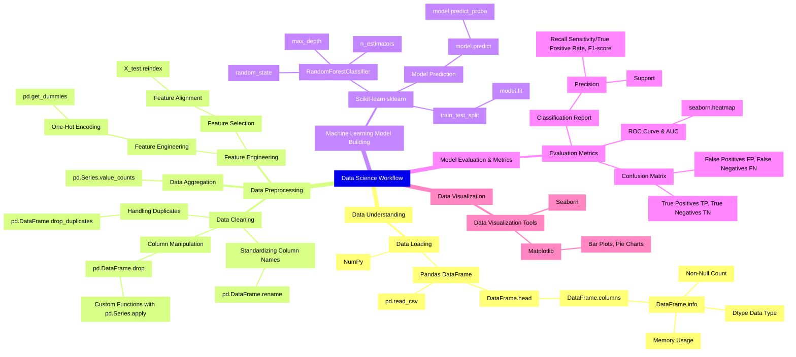

```mermaid
mindmap
  course_root[Data Science Workflow]
    mod_data_understanding[Data Understanding]
      concept_data_loading[Data Loading]
        concept_pandas_df[Pandas DataFrame]
          subtopic_pd_read_csv[pd.read_csv]
          subtopic_df_head[DataFrame.head]
            subtopic_df_columns[DataFrame.columns]
              subtopic_df_info[DataFrame.info]
                subtopic_non_null_count[Non-Null Count]
                subtopic_dtype[Dtype Data Type]
                subtopic_mem_usage[Memory Usage]
        concept_numpy[NumPy]
    mod_preprocessing[Data Preprocessing]
      mod_cleaning[Data Cleaning]
        concept_cleaning_duplicates[Handling Duplicates]
          subtopic_drop_duplicates[pd.DataFrame.drop_duplicates]
        concept_rename_columns[Standardizing Column Names]
          subtopic_rename_func[pd.DataFrame.rename]
        concept_column_manipulation[Column Manipulation]
          subtopic_df_drop[pd.DataFrame.drop]
            subtopic_apply_func[Custom Functions with pd.Series.apply]
      concept_data_aggregation[Data Aggregation]
        subtopic_value_counts[pd.Series.value_counts]
      mod_feature_engineering[Feature Engineering]
        concept_feature_engineering[Feature Engineering]
          subtopic_one_hot_encoding[One-Hot Encoding]
            subtopic_get_dummies[pd.get_dummies]
        concept_feature_selection[Feature Selection]
          subtopic_feature_alignment[Feature Alignment]
            subtopic_reindex[X_test.reindex]
    mod_model_building[Machine Learning Model Building]
      mod_ml_sklearn[Scikit-learn sklearn]
        concept_random_forest[RandomForestClassifier]
          subtopic_estimators[n_estimators]
          subtopic_max_depth[max_depth]
          subtopic_rand_state[random_state]
        concept_train_test_split[train_test_split]
          subtopic_model_fit[model.fit]
        concept_model_prediction[Model Prediction]
          subtopic_predict_func[model.predict]
            subtopic_proba_func[model.predict_proba]
    mod_evaluation[Model Evaluation & Metrics]
      mod_evaluation_metrics[Evaluation Metrics]
        concept_confusion_matrix[Confusion Matrix]
          subtopic_tp_tn[True Positives TP, True Negatives TN]
          subtopic_fp_fn[False Positives FP, False Negatives FN]
        concept_classification_report[Classification Report]
          subtopic_precision[Precision]
            subtopic_recall_f1[Recall Sensitivity/True Positive Rate, F1-score]
            subtopic_support[Support]
        concept_roc_auc[ROC Curve & AUC]
          subtopic_seaborn_heatmap[seaborn.heatmap]
    mod_visualization[Data Visualization]
      mod_data_viz[Data Visualization Tools]
        concept_matplotlib[Matplotlib]
          subtopic_bar_pie_charts[Bar Plots, Pie Charts]
        concept_seaborn[Seaborn]
```