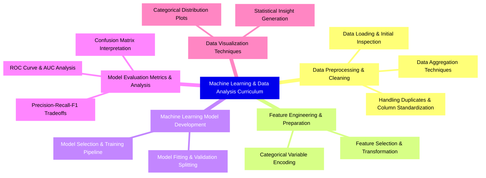

```mermaid
mindmap
  course_root[Machine Learning & Data Analysis Curriculum]
    topic_data_preprocessing[Data Preprocessing & Cleaning]
      subtopic_data_loading[Data Loading & Initial Inspection]
      subtopic_duplicates[Handling Duplicates & Column Standardization]
      subtopic_aggregation[Data Aggregation Techniques]
    topic_feature_engineering[Feature Engineering & Preparation]
      subtopic_categorical_encoding[Categorical Variable Encoding]
      subtopic_feature_selection[Feature Selection & Transformation]
    topic_model_development[Machine Learning Model Development]
      subtopic_model_training[Model Selection & Training Pipeline]
      subtopic_model_validation[Model Fitting & Validation Splitting]
    topic_model_evaluation[Model Evaluation Metrics & Analysis]
      subtopic_confusion_matrix[Confusion Matrix Interpretation]
      subtopic_precision_recall[Precision-Recall-F1 Tradeoffs]
      subtopic_roc_auc[ROC Curve & AUC Analysis]
    topic_data_visualization[Data Visualization Techniques]
      subtopic_categorical_plots[Categorical Distribution Plots]
      subtopic_statistical_insights[Statistical Insight Generation]
```