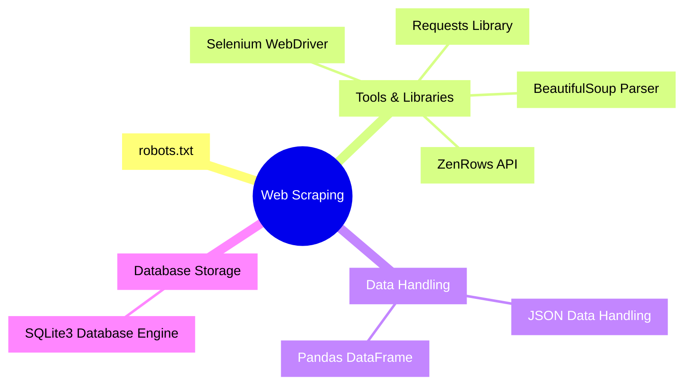

```mermaid
mindmap
root((Web Scraping))
    node_robots_txt[robots.txt]
    node_tools_libraries[Tools & Libraries]
        node_requests_lib[Requests Library]
        node_beautifulsoup_parser[BeautifulSoup Parser]
        node_selenium_webdriver[Selenium WebDriver]
        node_zenrows_api[ZenRows API]
    node_data_handling[Data Handling]
        node_json_handling[JSON Data Handling]
        node_pandas_df[Pandas DataFrame]
    node_database_storage[Database Storage]
        node_sqlite3_engine[SQLite3 Database Engine]
```