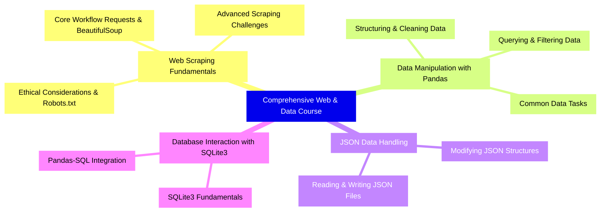

```mermaid
mindmap
  course_root[Comprehensive Web & Data Course]
    web_scraping[Web Scraping Fundamentals]
      ethical_scraping[Ethical Considerations & Robots.txt]
      core_workflow[Core Workflow Requests & BeautifulSoup]
      advanced_challenges[Advanced Scraping Challenges]
    pandas_data[Data Manipulation with Pandas]
      data_cleaning[Structuring & Cleaning Data]
      query_filtering[Querying & Filtering Data]
      common_tasks[Common Data Tasks]
    json_handling[JSON Data Handling]
      json_rw[Reading & Writing JSON Files]
      modify_json[Modifying JSON Structures]
    sqlite3_db[Database Interaction with SQLite3]
      sqlite_fundamentals[SQLite3 Fundamentals]
      pandas_sql_integration[Pandas-SQL Integration]
```