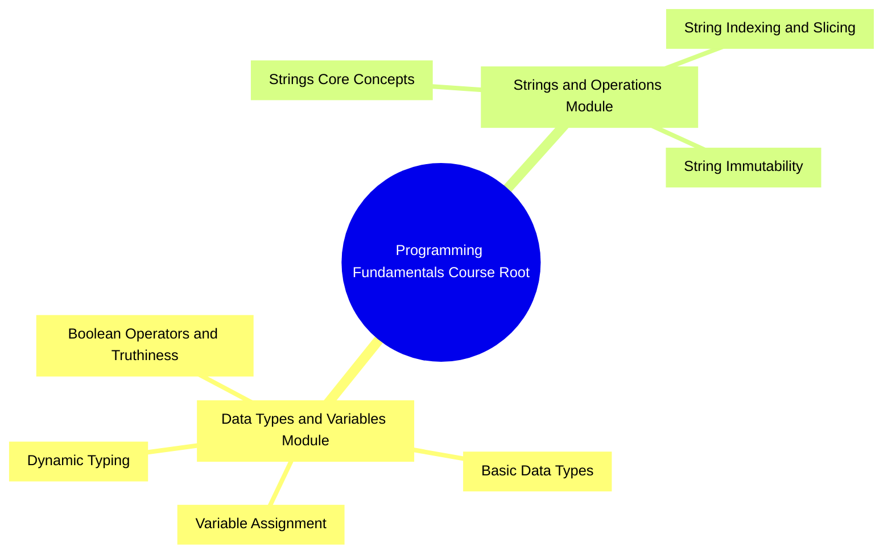

```mermaid
mindmap
root((Programming Fundamentals Course Root))
  mod_data_types[Data Types and Variables Module]
    concept_basic_data_types[Basic Data Types]
    subtopic_variable_assignment[Variable Assignment]
    concept_dynamic_typing[Dynamic Typing]
    concept_boolean_operators[Boolean Operators and Truthiness]
  mod_strings[Strings and Operations Module]
    concept_strings_core[Strings Core Concepts]
    subtopic_string_index_slicing[String Indexing and Slicing]
    concept_string_immutability[String Immutability]
```