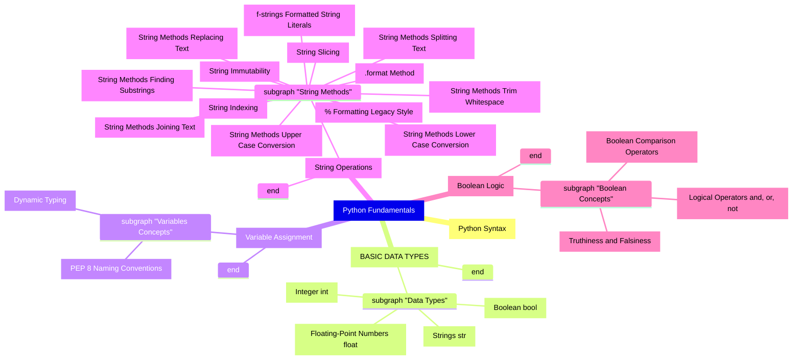

```mermaid
mindmap
    python_root[Python Fundamentals]
        mod_syntax[Python Syntax]
        mod_data_types[BASIC DATA TYPES]
            subgraph "Data Types"
                concept_int[Integer int]
                concept_float[Floating-Point Numbers float]
                concept_str[Strings str]
                concept_bool[Boolean bool]
            end
        mod_variables[Variable Assignment]
            subgraph "Variables Concepts"
                concept_dynamic_typing[Dynamic Typing]
                concept_pep8[PEP 8 Naming Conventions]
            end
        mod_strings[String Operations]
            subgraph "String Methods"
                subtopic_indexing[String Indexing]
                subtopic_slicing[String Slicing]
                subtopic_immutable[String Immutability]
                subtopic_upper[String Methods Upper Case Conversion]
                subtopic_lower[String Methods Lower Case Conversion]
                subtopic_trim[String Methods Trim Whitespace]
                subtopic_split[String Methods Splitting Text]
                subtopic_join[String Methods Joining Text]
                subtopic_find[String Methods Finding Substrings]
                subtopic_replace[String Methods Replacing Text]
                subtopic_fstrings[f-strings Formatted String Literals]
                subtopic_format[.format Method]
                subtopic_percent[% Formatting Legacy Style]
            end
        mod_booleans[Boolean Logic]
            subgraph "Boolean Concepts"
                concept_bool_ops[Boolean Comparison Operators]
                concept_logical_ops[Logical Operators and, or, not]
                concept_truthiness[Truthiness and Falsiness]
            end
```