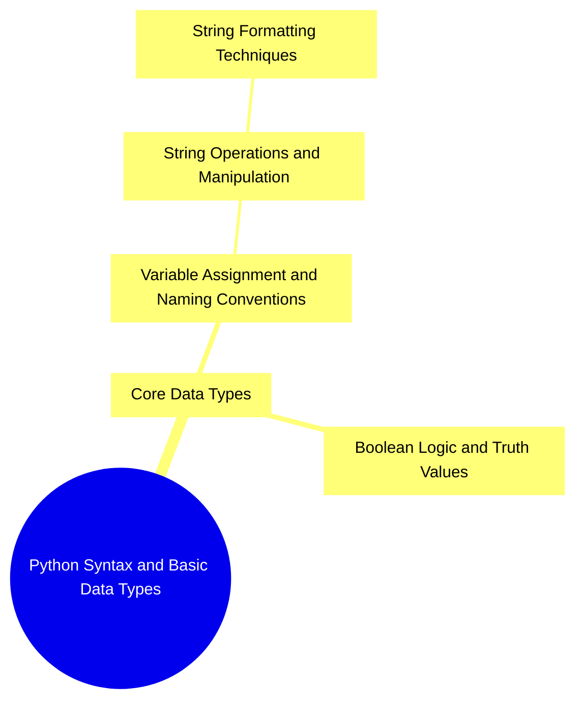

```mermaid
mindmap
  root((Python Syntax and Basic Data Types))
    core_data_types[Core Data Types]
      var_assign_naming[Variable Assignment and Naming Conventions]
        string_ops[String Operations and Manipulation]
          str_formatting[String Formatting Techniques]
      bool_logic[Boolean Logic and Truth Values]
```