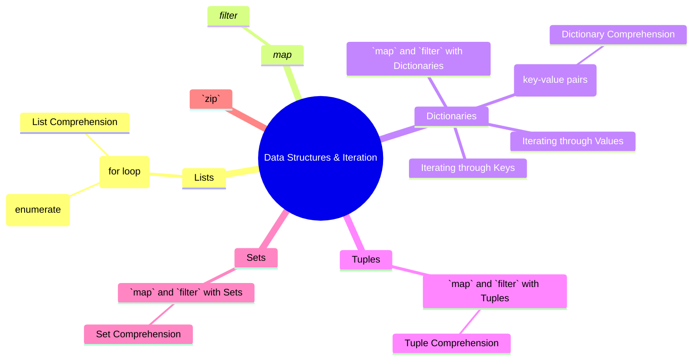

```mermaid
mindmap
  root((Data Structures & Iteration))
    Lists
      Basic Iteration (for loop)
        Iteration with Index (enumerate)
        List Comprehension
    _map_
      _filter_
    Dictionaries
      Iterating through Keys
      Iterating through Values
      Iterating through Items (key-value pairs)
        Dictionary Comprehension
      `map` and `filter` with Dictionaries
    Tuples
      `map` and `filter` with Tuples
        Tuple Comprehension
    Sets
      `map` and `filter` with Sets
        Set Comprehension
    `zip`
```