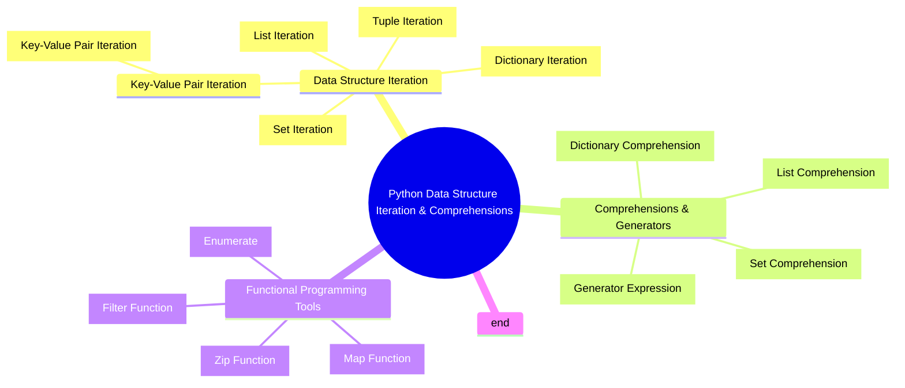

```mermaid
mindmap
root((Python Data Structure Iteration & Comprehensions))
    Data Structure Iteration
        concept_list_iter[List Iteration]
        concept_dict_iter[Dictionary Iteration]
        Key-Value Pair Iteration
            concept_kv_pair[Key-Value Pair Iteration]        
        concept_tuple_iter[Tuple Iteration]
        concept_set_iter[Set Iteration]
    
    Comprehensions & Generators
        concept_list_comp[List Comprehension]
        concept_dict_comp[Dictionary Comprehension]
        concept_set_comp[Set Comprehension]
        concept_gen_expr[Generator Expression]
    
    Functional Programming Tools
        concept_map[Map Function]
        concept_filter[Filter Function]
        concept_enum[Enumerate]
        concept_zip[Zip Function]
    end
```