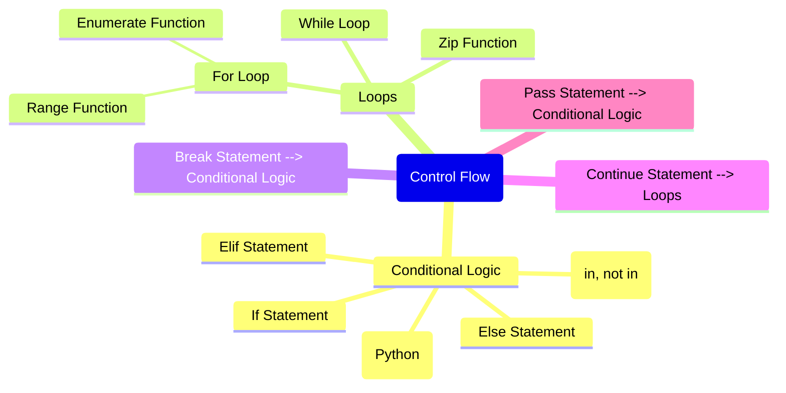

```mermaid
mindmap
  root(Control Flow)
    Conditional Logic
      If Statement
      Elif Statement
      Else Statement
      Indentation (Python)
      Membership Operators (in, not in)
    Loops
      For Loop
        Range Function
        Enumerate Function
      While Loop
      Zip Function
    Break Statement --> Conditional Logic
    Continue Statement --> Loops
    Pass Statement --> Conditional Logic
```