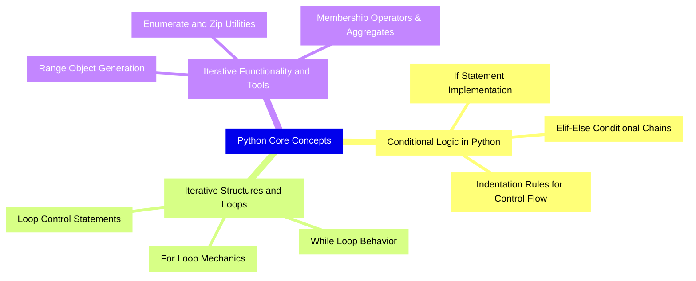

```mermaid
mindmap
  course_root[Python Core Concepts]
    Conditional_Logic[Conditional Logic in Python]
      If_Statement[If Statement Implementation]
      Elif_Else_Chains[Elif-Else Conditional Chains]
      Indentation_Rules[Indentation Rules for Control Flow]
    Iterative_Structures[Iterative Structures and Loops]
      For_Loop_Mechanics[For Loop Mechanics]
      While_Loop_Behavior[While Loop Behavior]
      Loop_Control_Statements[Loop Control Statements]
    Iterative_Tools[Iterative Functionality and Tools]
      Range_Object_Generation[Range Object Generation]
      Enumerate_Zip_Utils[Enumerate and Zip Utilities]
      Membership_Operators[Membership Operators & Aggregates]
```