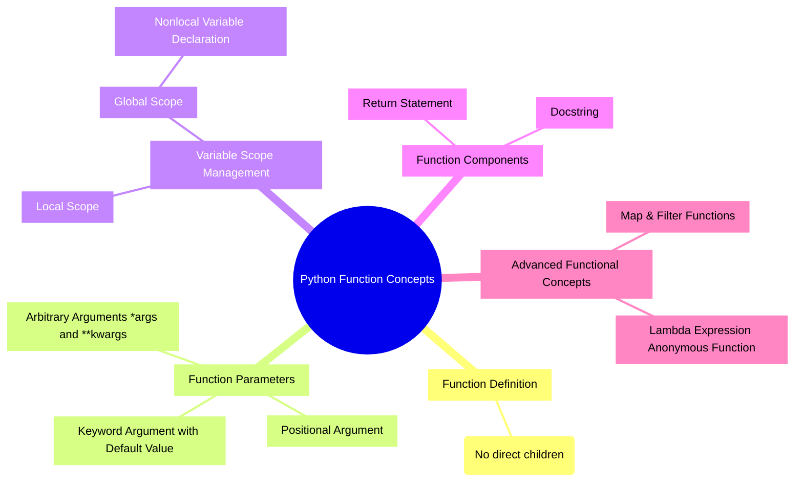

```mermaid
mindmap
root((Python Function Concepts))
    mod_function_definition[Function Definition]
        (No direct children)
    mod_parameters[Function Parameters]
        subpositional_arg[Positional Argument]
        subkeyword_default[Keyword Argument with Default Value]
        args_kwargs[Arbitrary Arguments *args and **kwargs]
    mod_scoping[Variable Scope Management]
        sublocal_scope[Local Scope]
        subglobal_scope[Global Scope]
            nonlocal_var[Nonlocal Variable Declaration]
    mod_return_docstring[Function Components]
        subreturn_stmt[Return Statement]
        subdocstring[Docstring]
    mod_advanced_funcs[Advanced Functional Concepts]
        lambda_expr[Lambda Expression Anonymous Function]
        map_filter_func[Map & Filter Functions]
```