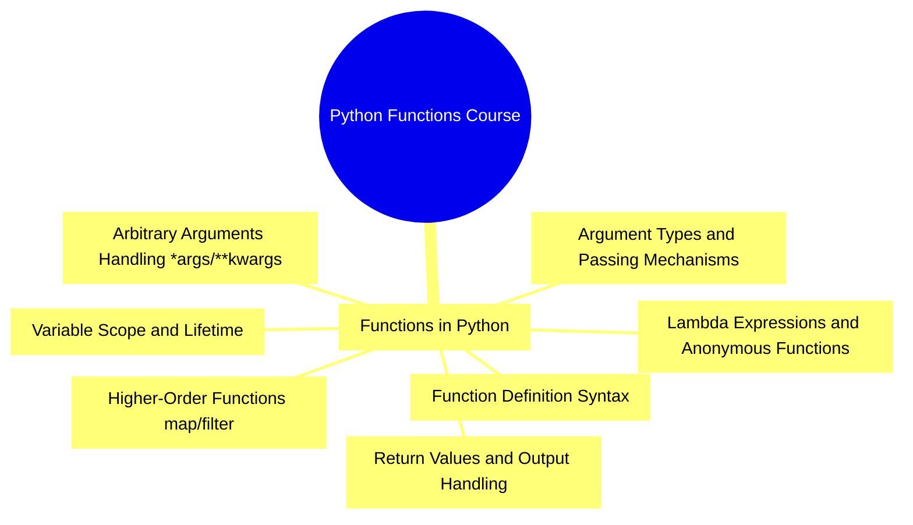

```mermaid
mindmap
root((Python Functions Course))
    functions_in_python[Functions in Python]
        func_def_syntax[Function Definition Syntax]
        args_types[Argument Types and Passing Mechanisms]
        return_values[Return Values and Output Handling]
        var_scope[Variable Scope and Lifetime]
        arbitrary_args[Arbitrary Arguments Handling *args/**kwargs]
        lambda_exprs[Lambda Expressions and Anonymous Functions]
        higher_order_funcs[Higher-Order Functions map/filter]
```