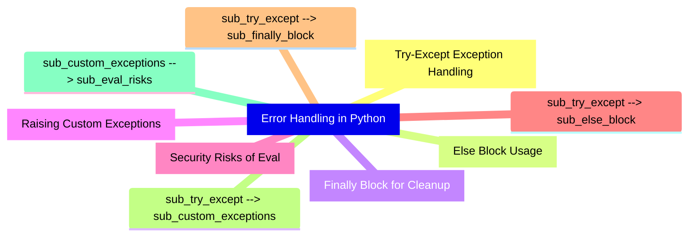

```mermaid
mindmap
  topic_error_handling[Error Handling in Python]
    sub_try_except[Try-Except Exception Handling]
    sub_else_block[Else Block Usage]
    sub_finally_block[Finally Block for Cleanup]
    sub_custom_exceptions[Raising Custom Exceptions]
    sub_eval_risks[Security Risks of Eval]
    
    sub_try_except --> sub_else_block
    sub_try_except --> sub_finally_block
    sub_try_except --> sub_custom_exceptions
    sub_custom_exceptions --> sub_eval_risks
```