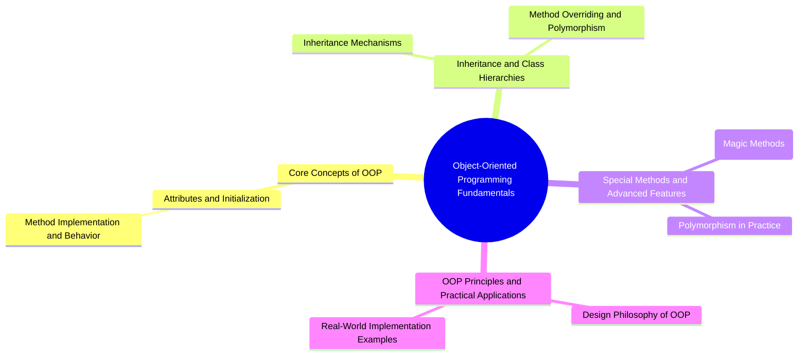

```mermaid
mindmap
  root((Object-Oriented Programming Fundamentals))
    Core Concepts of OOP
      Attributes and Initialization
        Method Implementation and Behavior
    Inheritance and Class Hierarchies
      Inheritance Mechanisms
      Method Overriding and Polymorphism
    Special Methods and Advanced Features
      Dunder Methods (Magic Methods)
      Polymorphism in Practice
    OOP Principles and Practical Applications
      Design Philosophy of OOP
      Real-World Implementation Examples
```