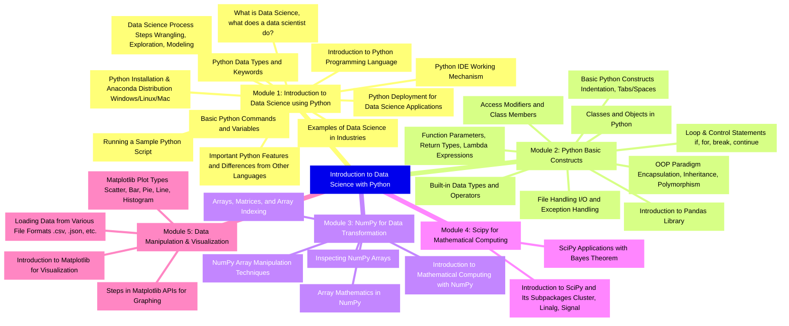

```mermaid
mindmap
  course_root[Introduction to Data Science with Python]
    mod1_intro_data_science[Module 1: Introduction to Data Science using Python]
      concept_data_science[What is Data Science, what does a data scientist do?]
      examples_industries[Examples of Data Science in Industries]
      python_deployment[Python Deployment for Data Science Applications]
      data_sci_steps[Data Science Process Steps Wrangling, Exploration, Modeling]
      python_introduction[Introduction to Python Programming Language]
      python_features[Important Python Features and Differences from Other Languages]
      installation_anaconda[Python Installation & Anaconda Distribution Windows/Linux/Mac]
      run_script[Running a Sample Python Script]
      ide_mechanism[Python IDE Working Mechanism]
      basic_commands[Basic Python Commands and Variables]
      data_types_keywords[Python Data Types and Keywords]
    mod2_python_basics[Module 2: Python Basic Constructs]
      basic_constructs[Basic Python Constructs Indentation, Tabs/Spaces]
      built_in_types[Built-in Data Types and Operators]
      control_statements[Loop & Control Statements if, for, break, continue]
      file_handling[File Handling I/O and Exception Handling]
      pandas_intro[Introduction to Pandas Library]
      oop_concepts[OOP Paradigm Encapsulation, Inheritance, Polymorphism]
      access_modifiers[Access Modifiers and Class Members]
      classes_objects[Classes and Objects in Python]
      functions_params[Function Parameters, Return Types, Lambda Expressions]
    mod3_numpy_data_transformation[Module 3: NumPy for Data Transformation]
      numpy_intro[Introduction to Mathematical Computing with NumPy]
      arrays_matrices[Arrays, Matrices, and Array Indexing]
      array_math_ops[Array Mathematics in NumPy]
      inspect_arrays[Inspecting NumPy Arrays]
      manipulate_arrays[NumPy Array Manipulation Techniques]
    mod4_scipy_math_computing[Module 4: Scipy for Mathematical Computing]
      scipy_intro[Introduction to SciPy and Its Subpackages Cluster, Linalg, Signal]
      bayes_theorem[SciPy Applications with Bayes Theorem]
    mod5_data_vis[Module 5: Data Manipulation & Visualization]
      data_loading[Loading Data from Various File Formats .csv, .json, etc.]
      matplotlib_intro[Introduction to Matplotlib for Visualization]
      plot_types[Matplotlib Plot Types Scatter, Bar, Pie, Line, Histogram]
      matplotlib_apis[Steps in Matplotlib APIs for Graphing]
```