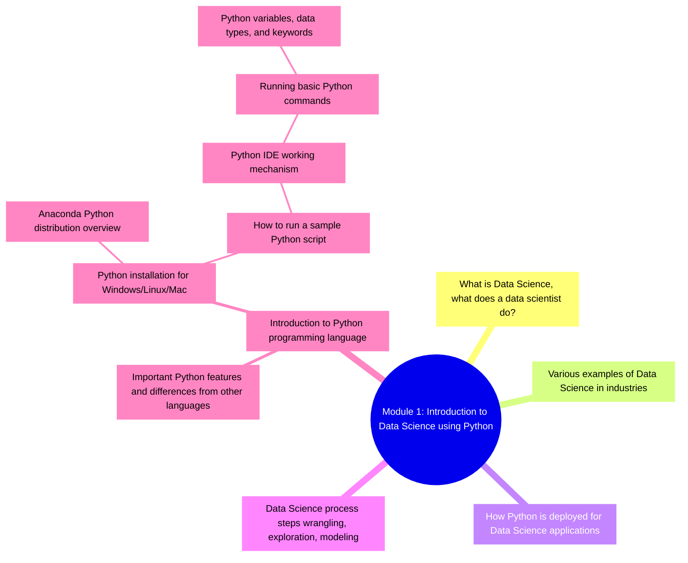

```mermaid
mindmap
  root((Module 1: Introduction to Data Science using Python))
    data_science_intro[What is Data Science, what does a data scientist do?]
    industry_examples[Various examples of Data Science in industries]
    python_role[How Python is deployed for Data Science applications]
    ds_process_steps[Data Science process steps wrangling, exploration, modeling]
    python_intro[Introduction to Python programming language]
      python_features[Important Python features and differences from other languages]
      installation_guide[Python installation for Windows/Linux/Mac]
        anaconda_dist[Anaconda Python distribution overview]
        running_scripts[How to run a sample Python script]
          ide_mechanism[Python IDE working mechanism]
            basic_commands[Running basic Python commands]
              variables_dtypes[Python variables, data types, and keywords]
```