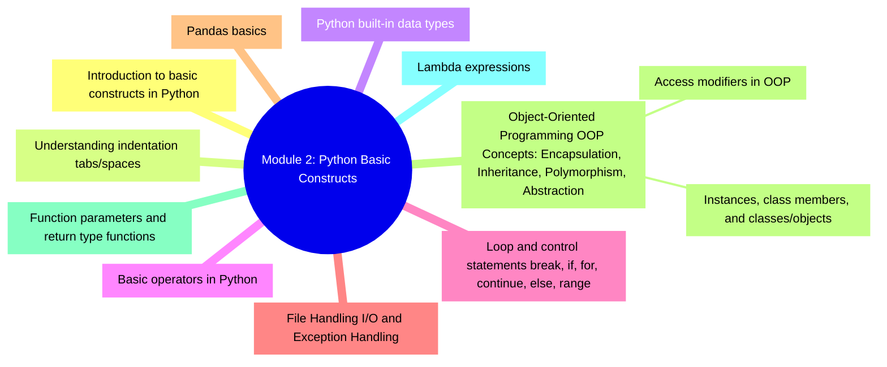

```mermaid
mindmap
    root((Module 2: Python Basic Constructs))
        intro_basic_constructs[Introduction to basic constructs in Python]
        indentation_principles[Understanding indentation tabs/spaces]
        built_in_data_types[Python built-in data types]
        basic_operators[Basic operators in Python]
        control_statements[Loop and control statements break, if, for, continue, else, range]
        file_handling_exceptions[File Handling I/O and Exception Handling]
        pandas_basics[Pandas basics]
        oop_concepts[Object-Oriented Programming OOP Concepts: Encapsulation, Inheritance, Polymorphism, Abstraction]
            access_modifiers[Access modifiers in OOP]
            class_members_instances[Instances, class members, and classes/objects]
        functions_parameters_returns[Function parameters and return type functions]
        lambda_expressions[Lambda expressions]
```