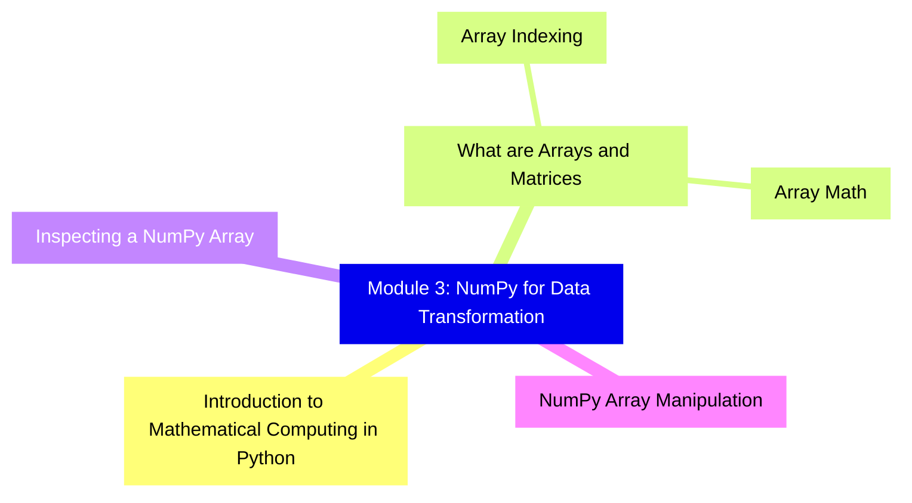

```mermaid
mindmap
  course_root[Module 3: NumPy for Data Transformation]
    mod_intro_math_python[Introduction to Mathematical Computing in Python]
    concept_arrays_matrices[What are Arrays and Matrices]
      subtopic_array_indexing[Array Indexing]
      subtopic_array_math[Array Math]
    subtopic_inspect_numpy[Inspecting a NumPy Array]
    subtopic_array_manipulation[NumPy Array Manipulation]
```