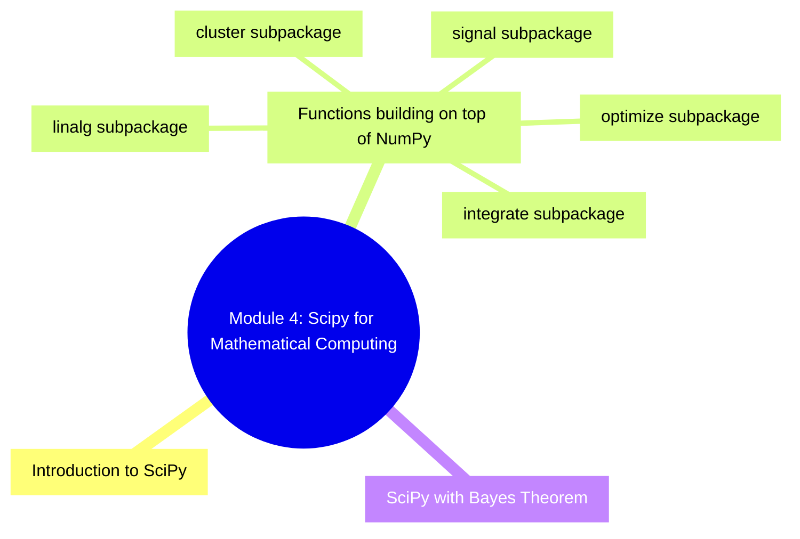

```mermaid
mindmap
  root((Module 4: Scipy for Mathematical Computing))
    intro_scipy[Introduction to SciPy]
    scipy_numpy_functions[Functions building on top of NumPy]
      subpkg_cluster[cluster subpackage]
      subpkg_linalg[linalg subpackage]
      subpkg_signal[signal subpackage]
      subpkg_optimize[optimize subpackage]
      subpkg_integrate[integrate subpackage]
    scipy_bayes_theorem[SciPy with Bayes Theorem]
```