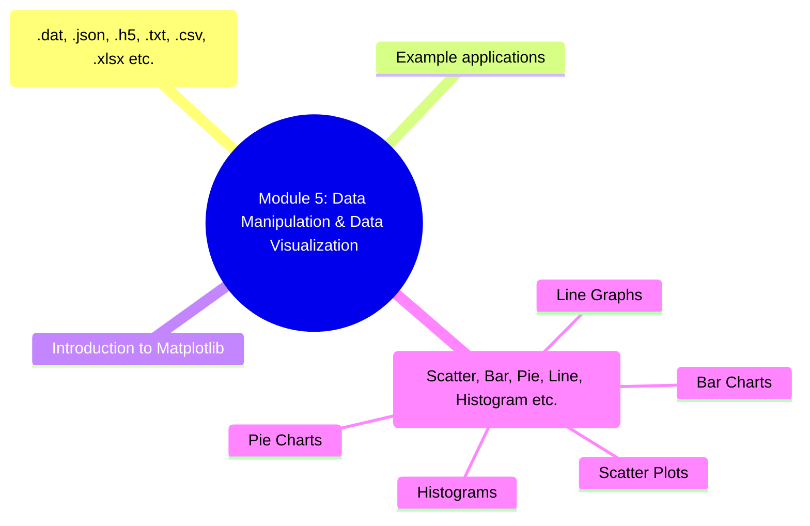

```mermaid
mindmap
root((Module 5: Data Manipulation & Data Visualization))
    Loading data from various files (.dat, .json, .h5, .txt, .csv, .xlsx etc.)
    Example applications
    Introduction to Matplotlib
    Using Matplotlib for plotting graphs and charts (Scatter, Bar, Pie, Line, Histogram etc.)
        Scatter Plots
        Bar Charts
        Pie Charts
        Line Graphs
        Histograms
```