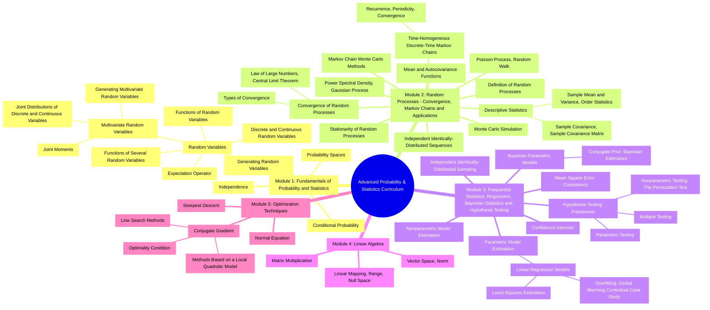

```mermaid
mindmap
root((Advanced Probability & Statistics Curriculum))
  mod1_fundamentals[Module 1: Fundamentals of Probability and Statistics]
    prob_spaces[Probability Spaces]
    cond_prob[Conditional Probability]
    independence[Independence]
    rv_intro[Random Variables]
      discrete_continuous_rv[Discrete and Continuous Random Variables]
      expectation_op[Expectation Operator]
      functions_rv[Functions of Random Variables]
      generating_rv[Generating Random Variables]
      multivariate_rv[Multivariate Random Variables]
        joint_dists[Joint Distributions of Discrete and Continuous Variables]
        joint_moments[Joint Moments]
        generating_multivariate_rv[Generating Multivariate Random Variables]
      functions_several_rv[Functions of Several Random Variables]
  mod2_random_processes[Module 2: Random Processes - Convergence, Markov Chains and Applications]
    rp_definition[Definition of Random Processes]
    stationary_rp[Stationarity of Random Processes]
    mean_auto_covariance[Mean and Autocovariance Functions]
    iid_sequences[Independent Identically-Distributed Sequences]
    psd_gaussian_process[Power Spectral Density, Gaussian Process]
    poisson_rw[Poisson Process, Random Walk]
    convergence_rp[Convergence of Random Processes]
      types_convergence[Types of Convergence]
      lln_clt[Law of Large Numbers, Central Limit Theorem]
    monte_carlo_sim[Monte Carlo Simulation]
    markov_chains_intro[Time-Homogeneous Discrete-Time Markov Chains]
      recurrence_periodicity[Recurrence, Periodicity, Convergence]
    mcmc_methods[Markov Chain Monte Carlo Methods]
    descriptive_stats[Descriptive Statistics]
      sample_stats[Sample Mean and Variance, Order Statistics]
      covariance_matrix[Sample Covariance, Sample Covariance Matrix]
  mod3_statistics_bayesian[Module 3: Frequentist Statistics, Regression, Bayesian Statistics and Hypothesis Testing]
    iid_sampling[Independent Identically-Distributed Sampling]
    mse_consistency[Mean Square Error, Consistency]
    confidence_intervals[Confidence Intervals]
    nonparametric_estimation[Nonparametric Model Estimation]
    parametric_estimation[Parametric Model Estimation]
      linear_regression[Linear Regression Models]
        least_squares[Least-Squares Estimation]
        overfitting_global_warming[Overfitting, Global Warming Contextual Case Study]
    bayesian_models[Bayesian Parametric Models]
      conjugate_priors[Conjugate Prior, Bayesian Estimators]
    hypothesis_testing[Hypothesis-Testing Framework]
      parametric_tests[Parametric Testing]
      nonparametric_tests[Nonparametric Testing: The Permutation Test]
      multiple_testing[Multiple Testing]
  mod4_linear_algebra[Module 4: Linear Algebra]
    vector_space_norm[Vector Space, Norm]
    linear_mapping[Linear Mapping, Range, Null Space]
    matrix_mult[Matrix Multiplication]
  mod5_optimization[Module 5: Optimization Techniques]
    normal_eqn[Normal Equation]
    steepest_descent[Steepest Descent]
    conjugate_gradient[Conjugate Gradient]
      optimality_cond[Optimality Condition]
      local_quad_model[Methods Based on a Local Quadratic Model]
      line_search_methods[Line Search Methods]
```