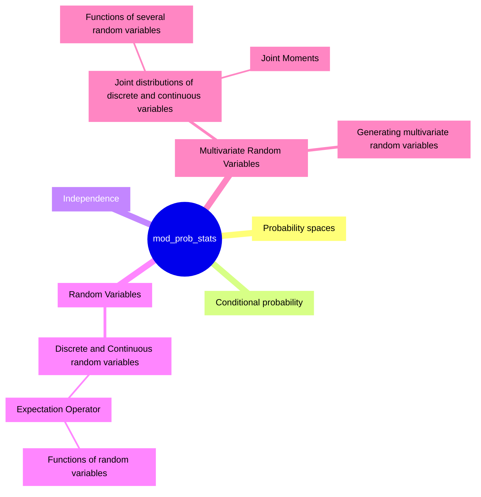

```mermaid
mindmap
root((mod_prob_stats))
  concept_prob_space[Probability spaces]
  concept_cond_prob[Conditional probability]
  concept_independence[Independence]
  concept_rv[Random Variables]
    subtopic_discrete_cont_rv[Discrete and Continuous random variables]
      concept_expectation[Expectation Operator]
        concept_func_rv[Functions of random variables]
  concept_multivariate_rv[Multivariate Random Variables]
    subtopic_joint_dist[Joint distributions of discrete and continuous variables]
      subtopic_func_several_rv[Functions of several random variables]
      concept_joint_moments[Joint Moments]
    subtopic_gen_multivariate_rv[Generating multivariate random variables]
```