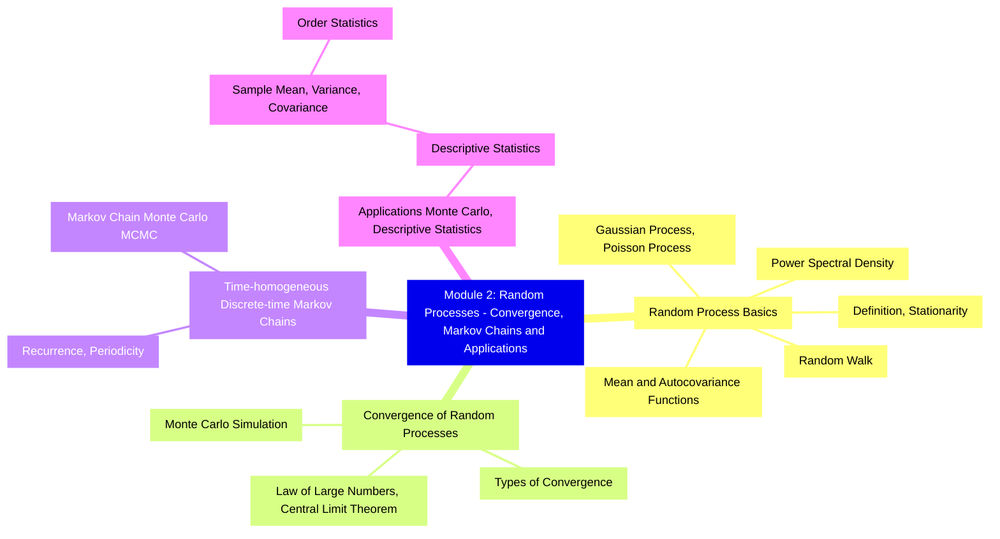

```mermaid
mindmap
module_2_root[Module 2: Random Processes - Convergence, Markov Chains and Applications]
    random_process_basics[Random Process Basics]
        definition_stationary[Definition, Stationarity]
        mean_autocovariance[Mean and Autocovariance Functions]
        power_spectral_density[Power Spectral Density]
        gaussian_poisson_processes[Gaussian Process, Poisson Process]
        random_walk[Random Walk]
    convergence_types[Convergence of Random Processes]
        types_convergence[Types of Convergence]
        lln_clt[Law of Large Numbers, Central Limit Theorem]
        monte_carlo_sim[Monte Carlo Simulation]
    markov_chains[Time-homogeneous Discrete-time Markov Chains]
        recurrence_periodicity[Recurrence, Periodicity]
        mcmc_methods[Markov Chain Monte Carlo MCMC]
    applications[Applications Monte Carlo, Descriptive Statistics]
        descriptive_stats[Descriptive Statistics]
            sample_statistics[Sample Mean, Variance, Covariance]
                order_statistics[Order Statistics]
```