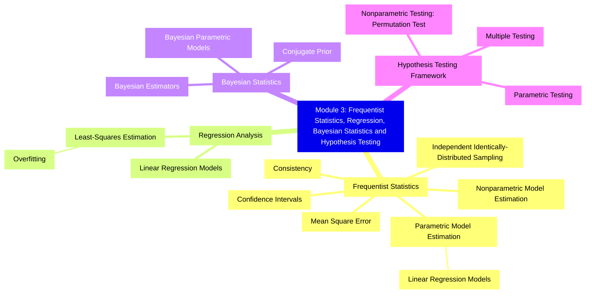

```mermaid
mindmap
  mod_03[Module 3: Frequentist Statistics, Regression, Bayesian Statistics and Hypothesis Testing]
    freq_stat[Frequentist Statistics]
      freq_iid_sampling[Independent Identically-Distributed Sampling]
      mean_square_error[Mean Square Error]
      consistency[Consistency]
      confidence_intervals[Confidence Intervals]
      parametric_estimation[Parametric Model Estimation]
        linear_regression_models[Linear Regression Models]
      nonparametric_estimation[Nonparametric Model Estimation]
    regression_analysis[Regression Analysis]
      linear_regression_models[Linear Regression Models]
      least_squares_estimation[Least-Squares Estimation]
        overfitting[Overfitting]
    bayesian_stats[Bayesian Statistics]
      bayesian_parametric_models[Bayesian Parametric Models]
      conjugate_prior[Conjugate Prior]
      bayesian_estimators[Bayesian Estimators]
    hypothesis_testing[Hypothesis Testing Framework]
      parametric_testing[Parametric Testing]
      nonparametric_permutation_test[Nonparametric Testing: Permutation Test]
      multiple_testing[Multiple Testing]
```