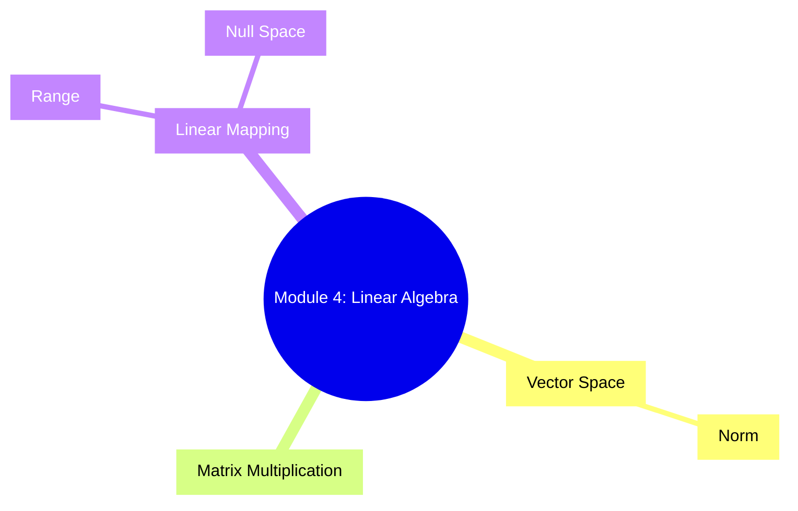

```mermaid
mindmap
  root((Module 4: Linear Algebra))
    concept_vector_space[Vector Space]
      concept_norm[Norm]
    concept_matrix_multiplication[Matrix Multiplication]
    concept_linear_mapping[Linear Mapping]
      subtopic_range[Range]
      subtopic_null_space[Null Space]
```